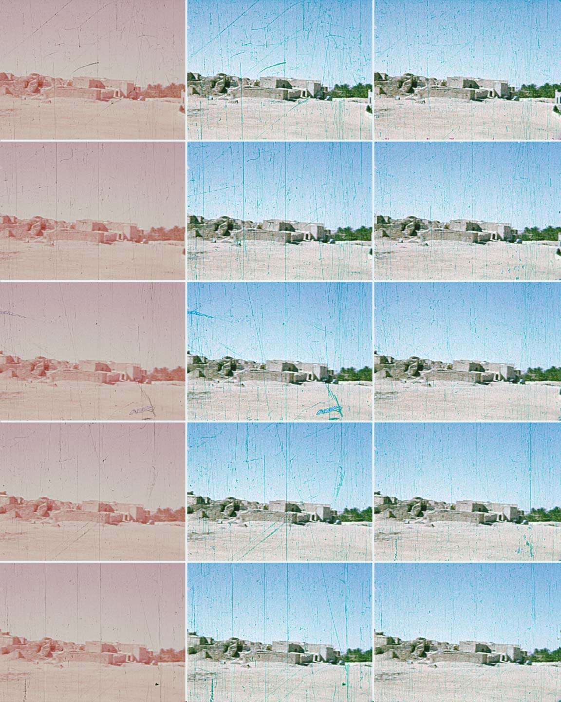

# Scratch detection and movie restoration 

The project is part of the course RRY025 - Image Processing at Chalmers University of Technology by Alessandro Romeo. 
Using image processing methods both in time and frequency domain, the scratches on the images below (representing frames of an old movie) could be detected and removed. 

